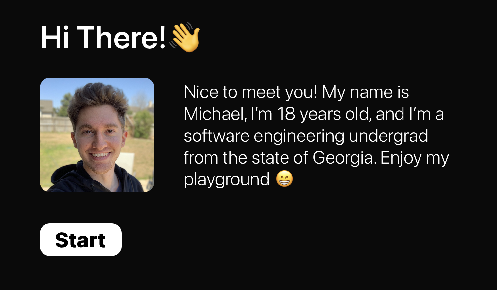
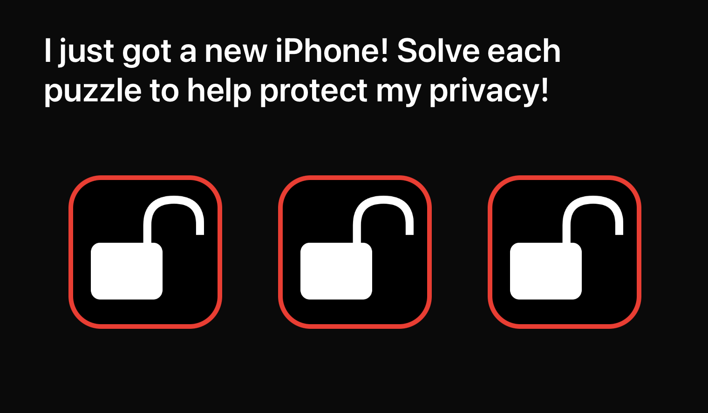
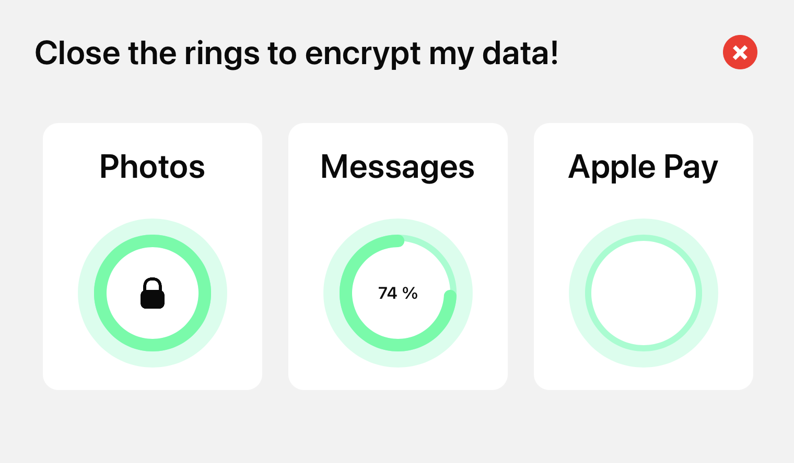
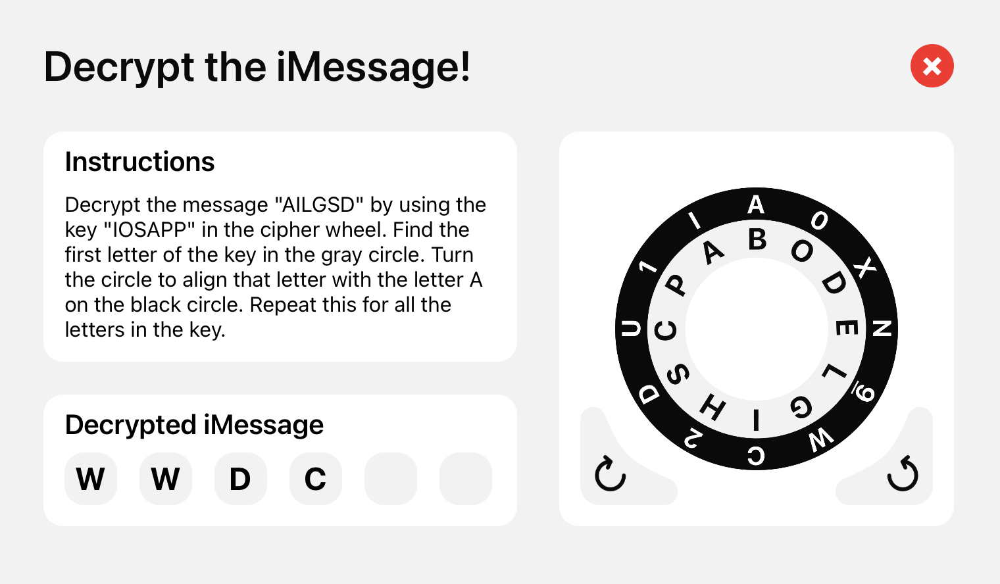
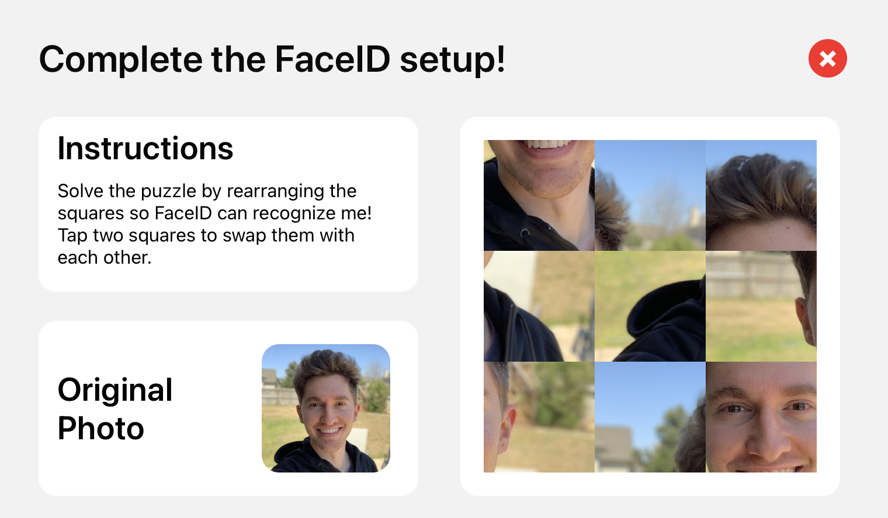
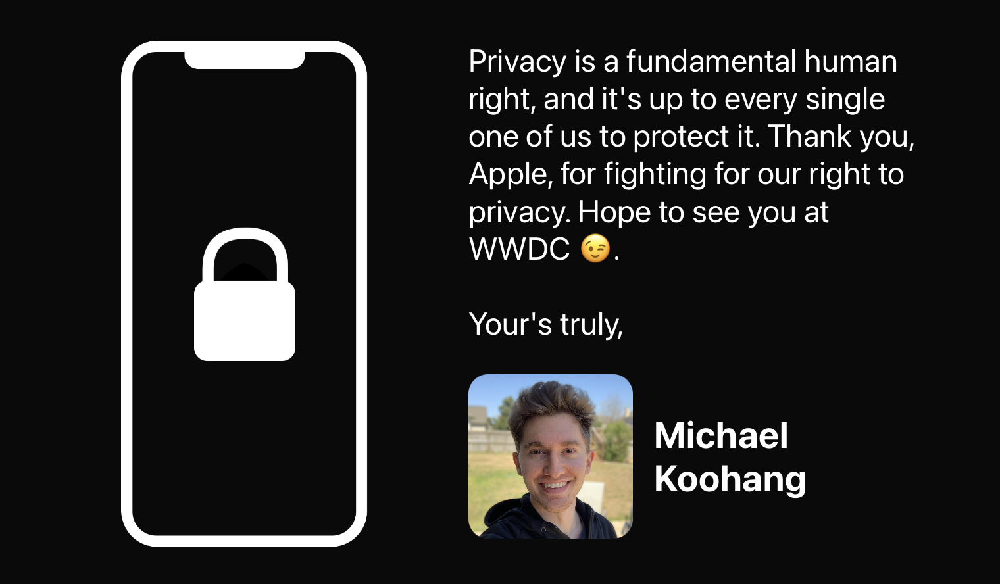

# WWDC 2019 Scholarship

## About

This is my submission to Apple's scholarship program for the 2019 World Wide Developer Conference. I was awarded one of 350 scholarships in the world to attend the conference. The premise of the playground is to educate users on how the iPhone protects their privacy in a fun and interactive way.

## How it works

You can download and open the playground using Xcode. When you run it, you'll be greeted with a start screen, followed by the game. Each puzzle is relatively simple to solve and highlights different aspects of the iPhone that protect your privacy. Once all the puzzles are solved, an end screen appears with a short message about the importance of privacy.

### Start

### Home

### Puzzle #1

### Puzzle #2

### Puzzle #3

### End

## Built with

* [Swift](https://swift.org/)
* [UIKit](https://developer.apple.com/documentation/uikit)
